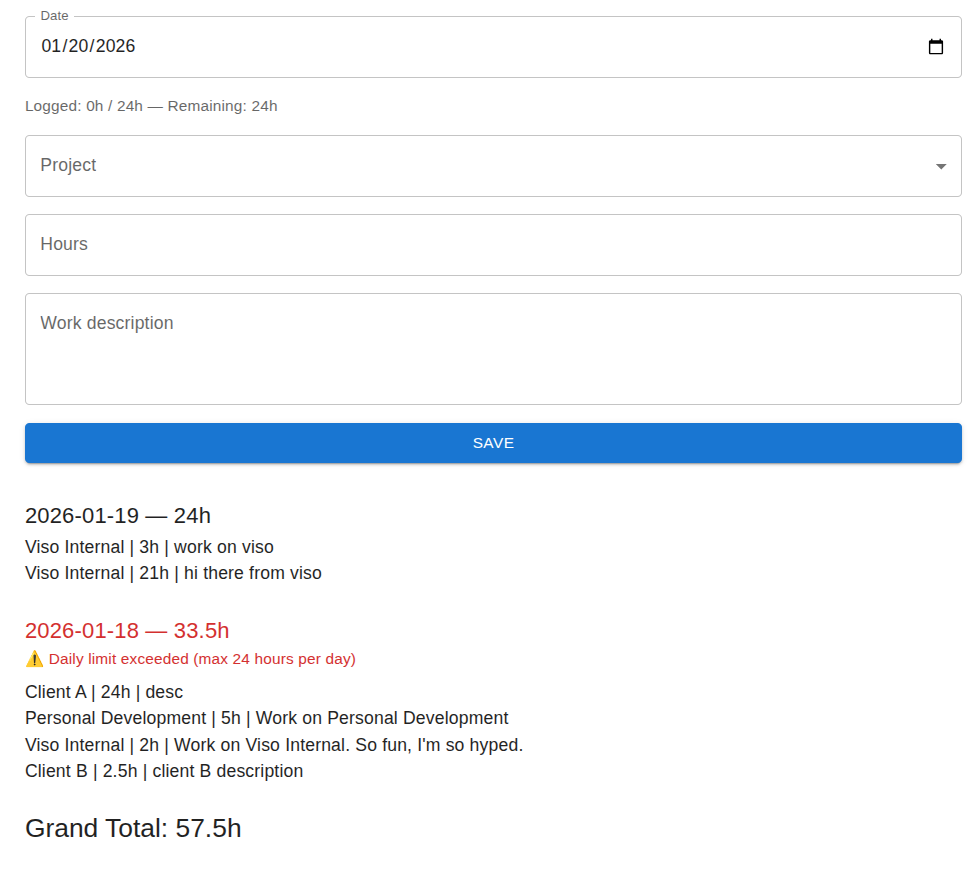

# ⏱️ Time Tracker App

A full-stack time tracking web application that allows users to log work hours per project, view daily history, and enforce a strict **maximum of 24 hours per calendar day**.

Built with modern, production-ready technologies for scalability and maintainability.

---

## ✨ Features

### Core Functionality
- Add time entries with:
    - Date (default: today)
    - Project (predefined list)
    - Hours worked
    - Work description
- View entry history **grouped by date**
- See totals:
    - Total hours per day
    - Grand total across all entries
- Prevent invalid data:
    - All fields required
    - Hours must be greater than `0`
    - **Cannot exceed 24 total hours per calendar day**
- Clear validation feedback and warnings in the UI

### Validation & Safety
- **Frontend validation** (UX-friendly)
- **Backend validation** (source of truth)
- Daily overflow prevention before saving
- Visual warnings when a day exceeds limits (history view)

---

## 🧱 Tech Stack

### Frontend
- **Next.js** (App Router)
- **React + TypeScript**
- **Material UI**
- Client-side validation & UX feedback

### Backend
- **Node.js + Express**
- **TypeScript**
- **REST API**
- **Prisma ORM**
- **PostgreSQL**

---

## 🚀 Running the App Locally

### Prerequisites
- **Node.js** `>= 18`
- **PostgreSQL** running locally
- **npm** or **pnpm**

---

### 1️ Clone the Repository

```
git clone https://github.com/dmitrydoroshko/time-tracker.git
cd time-tracker
```

### 2️ Install Dependencies
``` 
cd server
npm install
```

### 3 Create a file server/.env and enter your postgres data (e.g. user / password / host / port / database) and PORT for the server to run on. Example:
```
DATABASE_URL="postgresql://<user>:<password>@localhost:5432/timetracker"
PORT=4000
```

### 4 Start backend server 
```npm run dev```

Backend will run at:
http://localhost:4000

### 5 Frontend Setup (Next.js)
```
cd ../client
npm install
npm run dev
```

### 6 Frontend will run at
http://localhost:3000




